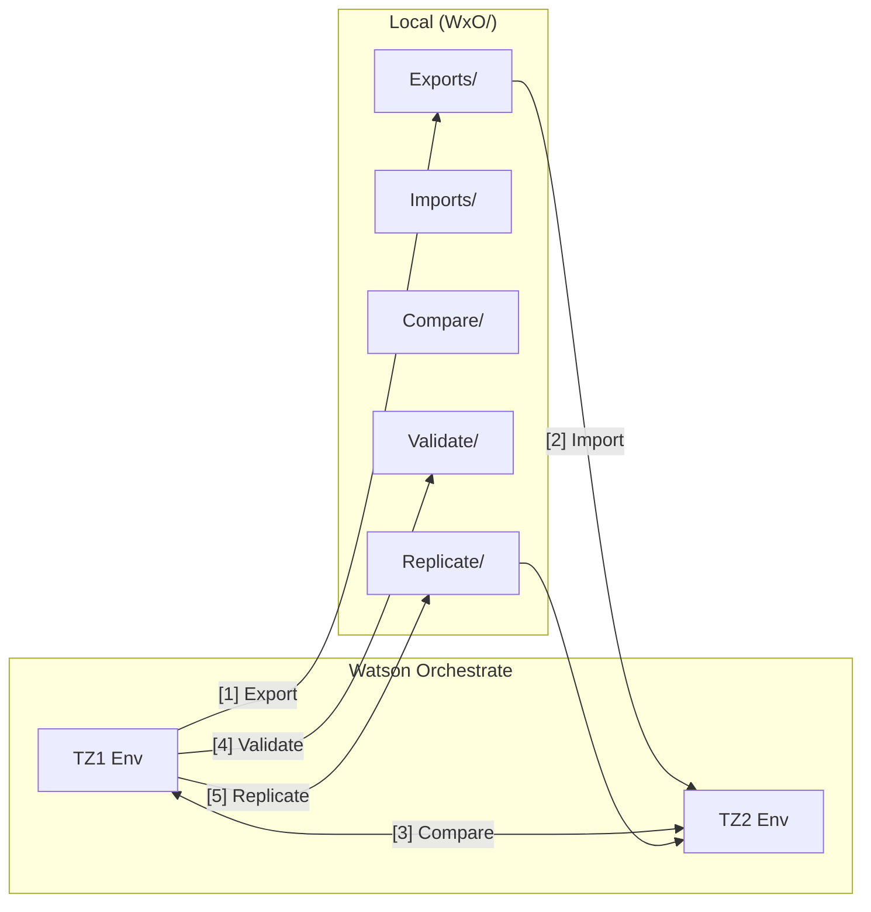
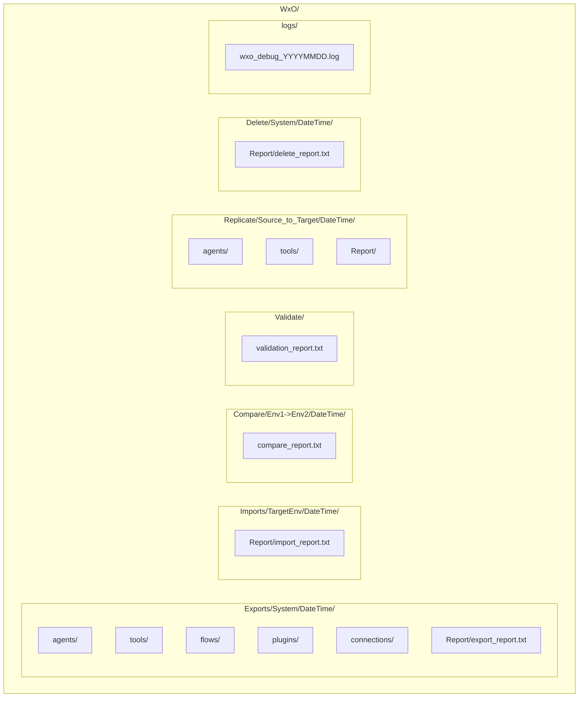
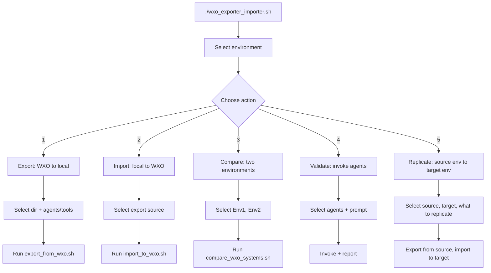

# WxO Importer/Export/Comparer/Validator

**Version:** 1.0.8

---

## Quick overview

CLI toolkit to move, compare, and validate IBM watsonx Orchestrate (WXO) resources between environments and local storage. **Uses the [orchestrate CLI](https://developer.watson-orchestrate.ibm.com/getting_started/installing)** — a shell wrapper around `orchestrate agents/tools/flows/connections` commands. Use it to export agents/tools/flows/connections, replicate across instances, diff configurations, or run agent validation.

**Requires:** [orchestrate CLI](https://developer.watson-orchestrate.ibm.com/getting_started/installing) · `jq`

Run the interactive menu: `./wxo_exporter_importer.sh` (see [Quick start](#quick-start)).

| Feature | What it does |
|---------|--------------|
| **Export** | Pull agents, tools, flows, plugins, connections to local (agents only, tools only, flows only, plugins only, connections only, or all with dependencies) |
| **Import** | Push from local exports or Replicate folders into any target environment |
| **Compare** | Diff agents, tools, and flows between two WXO environments |
| **Validate** | Invoke agents with a test prompt; optionally compare responses between systems |
| **Replicate** | Copy from source to target via Replicate/ folder (with/without deps) |
| **Danger Zone** | Delete agents, tools, flows, or connections (requires typing DELETE to confirm) |

**Author:** Markus van Kempen · mvankempen@ca.ibm.com · markus.van.kempen@gmail.com

**Related:** [**wxo-toolkit-vsc**](https://github.com/markusvankempen/wxo-toolkit-vsc) — VS Code extension that bundles these CLI scripts and provides a webview UI for Export, Import, Compare, Replicate.

---

## Overview



| Action | Direction | What it does |
|--------|-----------|--------------|
| **[1] Export** | WXO → Local | Pull agents, tools, flows, connections to `WxO/Exports/` |
| **[2] Import** | Local → WXO | Push from `WxO/Exports/` into target environment |
| **[3] Compare** | WXO ↔ WXO | Diff agents, tools, flows between two environments |
| **[4] Validate** | WXO → Report | Invoke agents with test prompt; optionally compare responses |
| **[5] Replicate** | WXO → WXO | Copy from source to target via Replicate/ folder (choose agents/tools, with/without deps) |
| **[6] Danger Zone** | WXO | Delete agents, tools, flows, or connections (with optional dependencies); requires typing DELETE to confirm |

---

Inspired by **Ajit Kulkarni** <ajit.kulkarni2@ibm.com>.  


---

## Quick start

```bash
cp .env.example .env
# Edit .env with your WXO_URL_<ENV> and WXO_API_KEY_<ENV>

chmod +x wxo_exporter_importer.sh export_from_wxo.sh import_to_wxo.sh compare_wxo_systems.sh setup_dependencies.sh
./setup_dependencies.sh --install   # check/install orchestrate CLI, jq, unzip
./wxo_exporter_importer.sh
```

**End-user guide:** See [USER_GUIDE.md](USER_GUIDE.md) for step-by-step instructions, UI walkthrough, and options for all use cases (Export, Import, Compare, Validate, Replicate).

**Validation guide:** See [VALIDATION_GUIDE.md](VALIDATION_GUIDE.md) for testing TZ1 ↔ TZ2 and running all CLI options.

**VS Code extension:** [**wxo-toolkit-vsc**](https://github.com/markusvankempen/wxo-toolkit-vsc) — a standalone extension that bundles these CLI scripts and provides a webview UI. Install from the [VS Code Marketplace](https://marketplace.visualstudio.com/items?itemName=markusvankempen.wxo-toolkit-vsc) or build from `vscode-extension/` in this repo. See [WxO-ADK-vscode-extension.md](WxO-ADK-vscode-extension.md).

**Version:** Run `./wxo_exporter_importer.sh --version` or check [VERSION](VERSION). See [CHANGELOG.md](CHANGELOG.md) for release history.

---

## Directory structure: WxO

Exports, imports, and compare reports use a structured layout under `WxO/` (default: `internal/watsonXOrchetrate_auto_deploy-main/WxO`):



```
WxO/
├── Systems/
│   └── <System>/
│       └── Connections/
│           ├── connection_secrets_report.txt   # what secrets each connection needs
│           └── .env_connection_<System>        # template; fill in before import
├── Exports/
│   └── TZ1/
│       └── 20260225_093419/       # DateTime-stamped export
│           ├── agents/
│           ├── tools/
│           ├── flows/
│           ├── plugins/
│           └── Report/
│               └── export_report.txt
├── Imports/
│   └── TZ2/
│       └── 20260225_094444/
│           └── Report/
│               └── import_report.txt
├── Compare/
│   └── TZ2->TZ1/
│       └── 20260225_123456/
│           └── compare_report.txt
├── Validate/                      # validation reports
├── Replicate/                     # replicate: export→Replicate/→import (separate from Exports)
│   └── <Source>_to_<Target>/
│       └── <DateTime>/
│           ├── agents/
│           ├── tools/
│           ├── flows/
│           ├── connections/
│           └── Report/
│               ├── export_report.txt
│               └── import_report.txt
├── Delete/                        # Danger Zone: reports of deleted resources
│   └── <System>/
│       └── <YYYYMMDD_HHMMSS>/
│           └── Report/
│               └── delete_report.txt
└── logs/                          # when WXO_DEBUG=1
```

Use `--env-name <System>` when exporting to create `WxO/Exports/<System>/<DateTime>/`. Without it, exports go to flat dirs like `export_<hostname>_<timestamp>`.

**Note:** `Exports/`, `Imports/`, `TestRun/`, `Compare/`, `Validate/`, `Replicate/`, `Delete/`, and `logs/` are listed in the repo `.gitignore` — they contain generated outputs and are not committed.

**Connection secrets:** When exporting connections, the script also creates `WxO/Systems/<System>/Connections/` with a `connection_secrets_report.txt` (lists required env vars per connection) and `.env_connection_<System>` (template). Fill in the template before import; the import script reads it and runs `orchestrate connections set-credentials` so connections become fully active.

**Backward compatibility:** The interactive script still reads from legacy `WxOExports/<System>/Export/<DateTime>/` when present.

---

## .env configuration

All scripts use a `.env` file for API keys and instance URLs. Copy `.env.example` to `.env` and fill in your values:

```bash
cp .env.example .env
```

| Variable | Description | Example |
|----------|-------------|---------|
| `WXO_URL_<ENV>` | WXO instance URL for environment | `WXO_URL_TZ1=https://api.us-south.watson-orchestrate.cloud.ibm.com/instances/xxx` |
| `WXO_API_KEY_<ENV>` | API key for environment | `WXO_API_KEY_TZ1=your-api-key` |
| `WO_INSTANCE_URL` | Default instance URL (when adding new env without per-env vars) | Same format as above |
| `WO_API_KEY` | Default API key | Your IBM Cloud API key |
| `WXO_ROOT` | Override WxO output dir | `WXO_ROOT=/path/to/WxO` |
| `ENV_FILE` | Override .env path | `ENV_FILE=/path/to/.env` (env var when running scripts) |

**Where scripts look for .env:** (in order) `watson-orchestrate-builder/.env`, `watsonx-orchestrate-devkit/.env`, `wxo-toolkit/.env`. Override with `ENV_FILE=/path/to/.env ./wxo_exporter_importer.sh`.

**Add new environment:** When adding via the interactive menu, the script prefills from `.env` if `WXO_URL_<name>` and `WXO_API_KEY_<name>` exist. Otherwise it prompts.

**Activate environment:** When selecting an existing env, the script uses `WXO_API_KEY_<ENV>` from `.env` if present; otherwise prompts.

---

## What's in here

### 1. [`wxo_exporter_importer.sh`](wxo_exporter_importer.sh) — **Main interactive script**

**What it does:**  
1. List envs from `orchestrate env list` — choose or add new (prefills from `.env` if `WXO_URL_<name>`, `WXO_API_KEY_<name>` exist); [0] Exit.  
2. Pick **Export** / **Import** / **Compare** / **Validate** / **Replicate**; [0] Back to env selection.  
3. Path breadcrumb shows current selection (e.g. `Home > TZ1 > Export > Directory`).  
4. Select directory (Import: System + DateTime; Export: existing or create new); [0] Back at each step.  
5. For Export/Import/Replicate: sub-menus for what to export/import/replicate; [0] Back.  
6. For Validate: select agents, test prompt; [0] Back.  
7. Run the chosen script.

**Guardrails:** Requires `orchestrate`, `jq`. Uses `.env` for API keys. Run `./wxo_exporter_importer.sh --version` for version info.

### 2. [`import_to_wxo.sh`](import_to_wxo.sh)

Imports agents, tools, and flows from local exports into a target WXO environment:

- **Python tools** from `tools/<name>/*.py` + `requirements.txt`
- **Plugin tools** from `plugins/<name>/*.py` + `requirements.txt` (agent_pre/post_invoke)
- **OpenAPI tools** from `tools/<name>/skill_v2.json` or `openapi.json`
- **Flow tools** from `flows/<name>/*.json` (or legacy `tools/<name>/*.json`); flows can contain tools and agents with their respective dependencies
- **Agents** from `agents/` (with bundled dependencies)
- **Connections** from `connections/` (when `WxO/Systems/<env>/Connections/.env_connection_<env>` exists, credentials are set via `orchestrate connections set-credentials`)

Options: `--agents-only`, `--tools-only`, `--flows-only`, `--plugins-only`, `--connections-only`, `--all`, `--if-exists skip|override`, `--validate`, `--validate-with-source <env>`.  
**Guardrails:** Requires `orchestrate`. Validates `agents/`, `tools/`, `flows/`, `plugins/`, or `connections/` exists.

### 3. [`export_from_wxo.sh`](export_from_wxo.sh)

Exports agents, tools, and flows from the active WXO environment:

- **Agents** (with optional tool/flow dependencies)
- **Tools** (Python, OpenAPI) → `tools/<name>/`
- **Flows** (agentic workflows) → `flows/<name>/`
- **Plugins** (agent_pre/post_invoke) → `plugins/<name>/`
- **Connections** (live) → `connections/<app_id>.yml`; also creates `WxO/Systems/<System>/Connections/` with secrets report + `.env_connection_<System>` template

Options: `--agents-only`, `--tools-only`, `--flows-only`, `--plugins-only`, `--connections-only`, `--agent-only` (YAML only), `--agent <name>`, `--tool <name>`, `--connection <app_id>`.  
With `--env-name <System>`: `WxO/Exports/<System>/<DateTime>/`.  
**Guardrails:** Requires `orchestrate`, `jq`, `unzip`. Writes formatted export report to `Report/export_report.txt`.

---

## What you need on disk

**After export**, each export dir (e.g. `WxO/Exports/TZ1/20260225_093419/`) contains:

```
<export_dir>/
├── agents/
│   └── <name>/                 (agents/native/*.yaml, tools/)
├── tools/
│   └── <name>/                 (Python: *.py + requirements.txt; OpenAPI: skill_v2.json)
├── flows/
│   └── <name>/                 (*.json flow definitions)
├── plugins/
│   └── <name>/                 (Python plugins: *.py + requirements.txt)
├── connections/
│   └── <app_id>.yml            (live connections only)
└── Report/
    └── export_report.txt
```

For import, use `--base-dir <export_dir>`. The scripts validate `agents/`, `tools/`, `flows/`, `plugins/`, or `connections/` exist.

---

## Setup

### System dependencies

Run `./setup_dependencies.sh` to check dependencies, or `./setup_dependencies.sh --install` to install missing ones interactively.

Manual install:

```
# orchestrate CLI (requires Python 3.11+)
pip install --upgrade ibm-watsonx-orchestrate   # ADK 2.5.0+ recommended

# jq, unzip (Linux)
sudo apt-get update -y && sudo apt-get install -y unzip jq

# jq (macOS)
brew install jq
```

### Platform compatibility (macOS / Linux)
Scripts are tested on **macOS** and **Linux**. For shell compatibility:

| Platform | `grep` | Notes |
|----------|--------|-------|
| macOS | BSD grep | Does **not** support GNU extensions like `\s` (whitespace) |
| Linux | GNU grep | Supports `\s` and other extensions |

Scripts use **POSIX patterns** so they work on both:

- Use `[[:space:]]` instead of `\s` in `grep -E` for whitespace — works on BSD (macOS) and GNU (Linux)
- This affects connection credential parsing (e.g. basic auth vs api_key detection); using `\s` on macOS would cause "No CONN_* in .env" warnings even when credentials exist

### Watson Orchestrate CLI
All scripts use the `orchestrate` CLI. Get it here:

https://developer.watson-orchestrate.ibm.com/getting_started/installing

---

## Using the scripts

### Interactive mode (recommended)



```
cd watsonXOrchestrate_auto_deploy
chmod +x wxo_exporter_importer.sh export_from_wxo.sh import_to_wxo.sh compare_wxo_systems.sh
./wxo_exporter_importer.sh
```

The script will:
1. List environments from `orchestrate env list` — choose one, or create/add a new environment
2. Ask: **Export** / **Import** / **Compare** / **Validate** / **Replicate**
3. Select directory: for Export — target (existing or new under WxO/Exports); for Import — Exports or Replicate folder; for Replicate — source env, target env
4. **Export:** Agents only, Tools only, Flows only, Plugins only, All, or Connections only (live); select which resources
5. **Import:** Agents, Tools, Flows, Plugins, Connections, or Folder (all); if-exists Override/Skip; optional post-import validation
6. **Compare:** Select two environments; report saved to `WxO/Compare/`
7. **Validate:** Select agents, test prompt, optionally compare with another system
8. **Replicate:** Select source env, target env, what to replicate (agents/tools/flows/connections); export to Replicate/ folder, import to target
9. Activate the environment and run the appropriate script

---

### Import: push local → WXO

1. Select target environment (or add new with URL + API key from `.env`)
2. Pick export source (System + DateTime from `WxO/Exports/`)
3. Choose what to import: Agents only, Tools only, Both, or Connections only; if-exists Override/Skip
4. Optionally validate imported agents with a test prompt
5. Imports from `agents/`, `tools/`, and `flows/` in the selected export dir

| Option | Description | Dependencies |
|--------|-------------|--------------|
| *(default)* | Import agents, tools, and flows | Connections via `--connections-only` separately |
| `--agents-only` | Import agents + their bundled tools/flows | ✓ Agent tool deps included |
| `--tools-only` | Import tools and flows from `tools/` and `flows/` | ✗ No agents, no connections |
| `--flows-only` | Import only flow tools from `flows/` | ✗ No connections |
| `--plugins-only` | Import plugin tools from `plugins/` | ✗ No agents, no connections |
| `--connections-only` | Import live connections | Use `.env_connection` for credentials |

**Import dependencies:** `--tools-only` imports only tools/flows; no connections. The default import includes agents+tools+flows but not connections — use `--connections-only` for those. For tools that need connections (e.g. OpenAPI), run connections import first.
| `--agent <name>` | Import only the specified agent (and its deps) |
| `--tool <name>` | Import only the specified tool |
| `--connection <app_id>` | Import only the specified connection |
| `--base-dir <dir>` | Base directory containing agents/, tools/, flows/, connections/ (default: current dir) |
| `--env <name>` | Use existing orchestrate environment (skip URL prompt) |
| `--no-credential-prompt` | Env already active; skip URL/API key prompts |
| `--report <file>` | Append import report (type, name, status, id) to file |
| `--report-dir <dir>` | Write report to `<dir>/Report/import_report.txt` |
| `--if-exists <mode>` | When resource exists: `skip` (do not import) or `override` (update, default) |
| `--validate` | After import, invoke each agent with a test prompt; report if it responds |
| `--validate-with-source <env>` | Also run test on source env; compare responses (e.g. TZ1) |
| `-h`, `--help` | Show help |

```
cd watsonXOrchetrate_auto_deploy
chmod +x import_to_wxo.sh
./import_to_wxo.sh
./import_to_wxo.sh --agents-only
./import_to_wxo.sh --tool format_address
./import_to_wxo.sh --agent name_address_agent
./import_to_wxo.sh --report deploy_report.txt
./import_to_wxo.sh --if-exists skip    # skip resources that already exist
```

After each run, an **Import Report** is printed: a table of each tool/agent with status (OK/FAILED/SKIPPED), ID (if the CLI returns one), and error notes for failures.

**If resource exists:** Use `--if-exists skip` to skip agents, tools, and flows that already exist (same name) in the target environment—useful for incremental updates or avoiding overwrites. Default is `override`, which attempts to import (update) even when a resource exists.

**Report location:** Use `--report <file>` for an explicit path, or `--report-dir <dir>` for structured output: `WxO/Imports/{Env}/{DateTime}/Report/import_report.txt`.

**Validation (optional):** Use `--validate` to invoke each imported agent with a test prompt ("Hello") and verify it responds. Add `--validate-with-source TZ1` to run the same prompt on the source env and compare responses (LLM output may vary). *Note: The orchestrate CLI can only invoke agents; flows and tools are not validated.*

---

### Export: pull WXO → local

By default, this exports agents with their tools and flows, plus every tool in your environment. Output is saved under `export_<hostname>_<timestamp>` (e.g. `export_mymac_20250225_143022`).

| Option | What you get |
|--------|--------------|
| *(default)* | Agents with dependencies + all tools + flows |
| `--agent-only` | Just the agent YAML (no tools/flows) |
| `--agents-only` | Agents only (optionally with deps) |
| `--tools-only` | Tools only (Python, OpenAPI) |
| `--flows-only` | Flow tools only → `flows/` |
| `--plugins-only` | Plugin tools only (agent_pre/post_invoke) → `plugins/` |
| `--connections-only` | Live connections only → `connections/<app_id>.yml` |
| `--env-name <name>` | Structured output: `WxO/Exports/<name>/<DateTime>/` (default base: WxO) |
| `--agent <name>` | Export only the specified agent(s); comma-separated for multiple |
| `--tool <name>` | Export only the specified tool(s); comma-separated for multiple |
| `--tool-type <types>` | Export only these tool types; comma-separated: `python`, `openapi`, `flow` (default: all) |
| `--connection <app_id>` | Export only the specified connection(s); comma-separated |
| `-o`, `--output-dir <dir>` | Base dir (with --env-name) or exact output path |
| `--report <file>` | Write export report to file |
| `--report-dir <dir>` | Write report to `<dir>/Report/export_report.txt` |
| `-h`, `--help` | Show options |

```
cd watsonXOrchetrate_auto_deploy
chmod +x export_from_wxo.sh
./export_from_wxo.sh
./export_from_wxo.sh --agent-only       # YAML only
./export_from_wxo.sh --tools-only       # tools only
./export_from_wxo.sh --flows-only       # flows only
./export_from_wxo.sh --plugins-only     # plugins only
./export_from_wxo.sh --connections-only # live connections only
./export_from_wxo.sh -o my_backup       # custom output dir
./export_from_wxo.sh --env-name TZ1     # WxO/Exports/TZ1/<DateTime>/
./export_from_wxo.sh --agent MyAgent --tool MyTool
```

**Export report:** After each run, an **Export Report** lists each agent/tool with status (OK/FAILED), counts, and any error notes. With `--env-name` the report is auto-saved to `WxO/Exports/<System>/<DateTime>/Report/export_report.txt`.

**Tip:** Make sure an environment is active first: `orchestrate env activate <env name>`

To deploy from an export directory: `./import_to_wxo.sh --base-dir WxO/Exports/TZ1/20260225_093419` or `./import_to_wxo.sh --base-dir export_mymac_20250225_143022` (flat exports).

---

## Test script

[`test_wxo_export_import.sh`](test_wxo_export_import.sh) automates a full export/import cycle for testing:

1. Exports agents (with dependencies) from **TZ1** to `WxO/Exports/TZ1/<DateTime>/`
2. Imports **MarkusMultiToolsAgent** (and its deps) into **TZ2**
3. Optionally validates **Flow** export/import: exports **name_address_agent** (with `name_address_form_flow`) from TZ1 and imports into TZ2

```bash
./test_wxo_export_import.sh
```

**API keys:** `.env` with `WXO_API_KEY_TZ1` and `WXO_API_KEY_TZ2`, or `../vscode-extension/.env` (mapped from `SYNC_TZ1_API_KEY`/`WO_API_KEY`). If keys are missing, you'll be prompted (interactive) or must set env vars for non-interactive/CI use.

### Full test permutations: `run_wxo_tests.sh`

[`run_wxo_tests.sh`](run_wxo_tests.sh) runs all export/import permutations, validate, compare, and `import_tool_with_connection` — useful for regression testing after orchestrate CLI upgrades (e.g. ADK 2.5.0). Output goes to `WxO/TestRun/<datetime>/`:

```bash
./run_wxo_tests.sh              # Full mode (all permutations)
./run_wxo_tests.sh --quick      # Quick subset (tools export + import; ~2 min)
./run_wxo_tests.sh --list       # List test cases
./run_wxo_tests.sh --source TZ1 --target TZ2 --out-dir ./my_results
./run_wxo_tests.sh --full --no-validate   # Full run, skip validate (faster)
```

| Option | Description |
|--------|-------------|
| `--quick` | Run tools export, import only (faster) |
| `--full` | All permutations: agents, tools, flows, connections, import modes, validate, compare, News/FerryWeather replicate |
| `--no-validate` | Skip `--validate` after imports (faster) |
| `--out-dir <dir>` | Override output (default: `WxO/TestRun/<datetime>`) |

**Prerequisites:** `.env` with `WXO_API_KEY_<SOURCE>`, `WXO_API_KEY_<TARGET>`. The script also loads `../vscode-extension/.env` and maps `SYNC_TZ1_API_KEY`/`WO_API_KEY` to `WXO_API_KEY_*` when present. Optionally `.env_connection_<SOURCE>` for tools with connections (News, FerryWeather).

---

## Compare systems

[`compare_wxo_systems.sh`](compare_wxo_systems.sh) compares agents, tools, and flows between two WXO environments and produces a report table:

```
./compare_wxo_systems.sh TZ1 TZ2
./compare_wxo_systems.sh                    # select interactively
./compare_wxo_systems.sh TZ1 TZ2 -o report.txt   # or auto-saved to WxO/Compare/TZ1->TZ2/<DateTime>/
```

| Option | Description |
|--------|-------------|
| `ENV1 ENV2` | Environment names to compare |
| `-o, --output <file>` | Write report to file (CSV-style). If omitted, auto-saves to `WxO/Compare/<Env1>-><Env2>/<DateTime>/compare_report.txt` |
| `--env-file <path>` | Path to .env for API keys (WXO_API_KEY_<ENV>) |
| `-h, --help` | Show help |

The report shows ✓/– for each system and "both" or "only X" for the diff column. API keys: use `WXO_API_KEY_TZ1`, `WXO_API_KEY_TZ2` in `.env`, or enter at prompt.

---

## Validate agents

From the main menu, choose **[4] Validate** to invoke agents with a test prompt (e.g. "Hello"), verify they respond, and optionally compare responses with another environment. Reports are saved to `WxO/Validate/<Target>-><Source>/<DateTime>/validation_report.txt`.

---

## Quick reference

| Script | What it does |
|--------|--------------|
| `wxo_exporter_importer.sh` | Interactive menu: Export, Import, Compare, Validate, Replicate |
| `export_from_wxo.sh` | Exports agents, tools, flows to `WxO/Exports/` |
| `import_to_wxo.sh` | Imports from `agents/`, `tools/`, `flows/` into WXO |
| `compare_wxo_systems.sh` | Compares agents, tools, flows between two environments |
| `run_wxo_tests.sh` | Runs export/import permutations, validate, compare (output: `WxO/TestRun/`) |
| `create_and_replicate_news_tool.sh` | Create News Tool (NewsAPI) in TZ1, export, replicate to TZ2 |
| `create_and_replicate_ferry_weather_tool.sh` | Create FerryWeather tool in TZ1, export, replicate to TZ2 |

---

## Guardrails and validation

| Check | Scripts | Behavior |
|-------|---------|----------|
| `orchestrate` CLI | All | Exit with install URL if not found |
| `jq` | Main, export, compare, test | Exit if not found |
| `unzip` | Export | Exit if not found |
| `agents/`, `tools/`, `flows/` | Import | Exit if none exist |
| `.env` for API keys | Main, import, compare, test | Use when present; prompt otherwise |
| `WXO_DEBUG=1` or `WXO_LOG=1` | Main, export, import | Log orchestrate commands to console and `WxO/logs/wxo_debug_YYYYMMDD.log` |

**Debug/log:** Set `WXO_DEBUG=1` (or `WXO_LOG=1`) in `.env` or when running to see each `orchestrate` command and capture session logs for troubleshooting. For Replicate, this also prints step-by-step trace (`[REPL-DEBUG]`) to help diagnose early exits.

---

## When things go wrong

**"No environment active"**  
Activate one first: `orchestrate env activate bootcamp` (or your env name).

**"orchestrate CLI not found"**  
Install: https://developer.watson-orchestrate.ibm.com/getting_started/installing

**"jq required"**  
Install: `apt-get install jq` or `brew install jq`

**"No exports directory found"** (Import)  
Run Export first to create `WxO/Exports/<System>/<DateTime>/`, or ensure you have existing export dirs with `agents/` or `tools/`.

**"No CONN_* in .env_connection_*"** (Connection credentials not applied)  
If credentials exist in `.env_connection_<System>` but the script reports them missing, this can be caused by macOS (BSD) `grep` not supporting `\s`. Scripts use POSIX `[[:space:]]` for compatibility; ensure you're on the latest version.

**Missing directories**  
Run: `mkdir -p tools agents`

---

## License

Apache-2.0 — See [LICENSE](LICENSE) for details.

[CHANGELOG](CHANGELOG.md)

