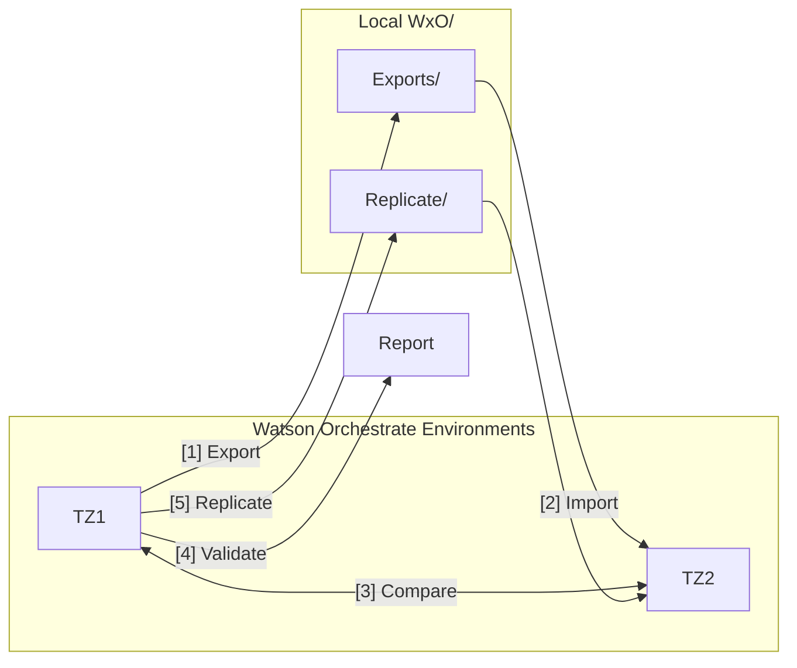
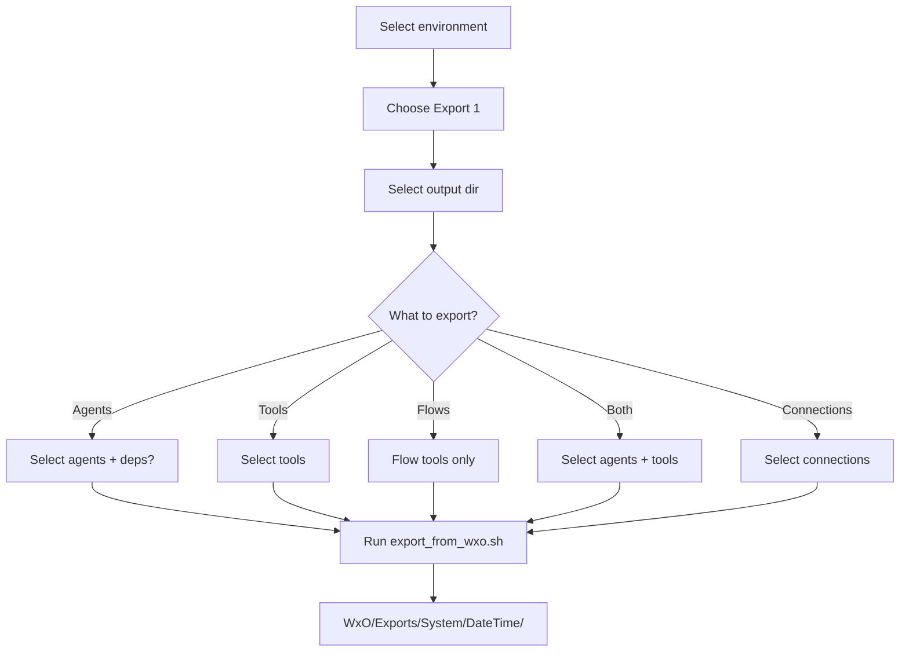
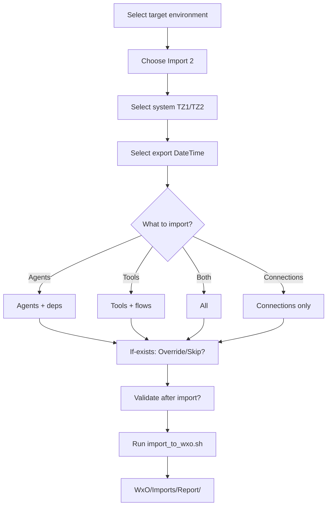
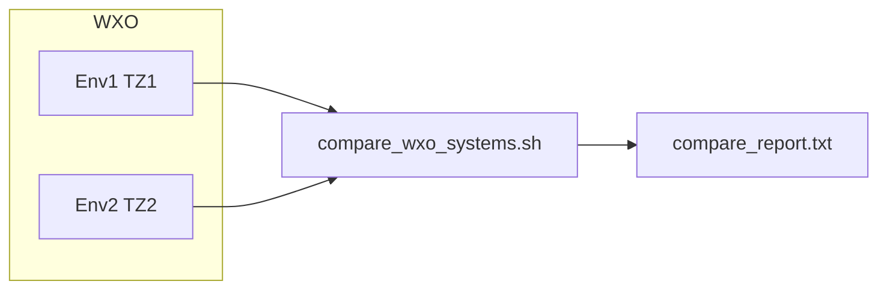
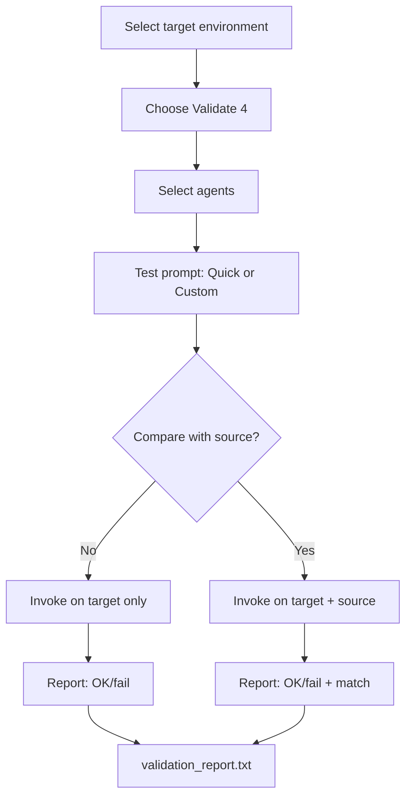
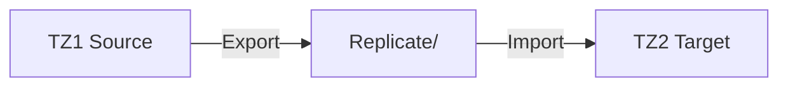
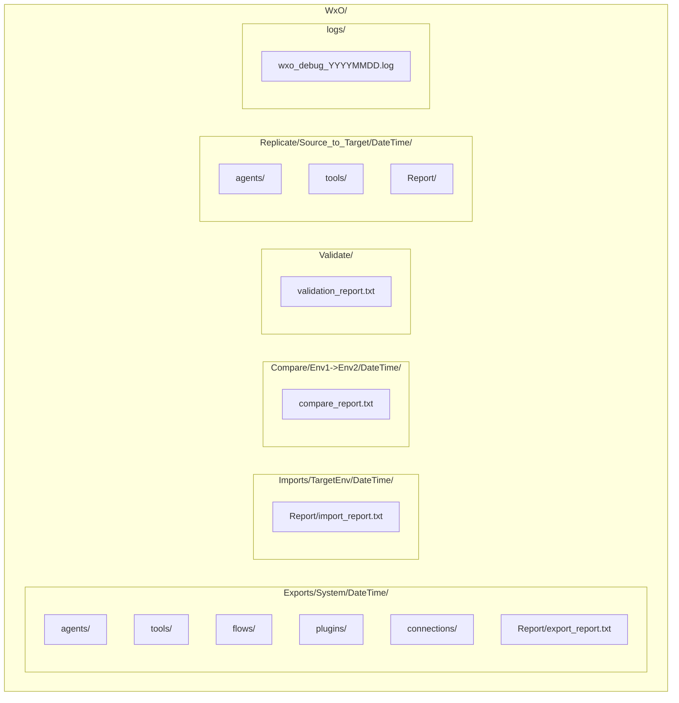

# WxO-ToolBox-cli — End User Guide

**Version:** 1.0.9 (Mar 2, 2026)  
**Author:** Markus van Kempen
**Audience:** End users who want to export, import, compare, validate, or replicate Watson Orchestrate (WXO) resources using the interactive CLI.

---

## Table of Contents
1. [Prerequisites](#prerequisites)
2. [Quick Start](#quick-start)
3. [Overview Diagram](#overview-diagram)
4. [Main Menu](#main-menu)
5. [Use Case 1: Export](#use-case-1-export)
6. [Use Case 2: Import](#use-case-2-import)
7. [Use Case 3: Compare](#use-case-3-compare)
8. [Use Case 4: Validate](#use-case-4-validate)
9. [Use Case 5: Replicate](#use-case-5-replicate)
10. [Use Case 6: Danger Zone (Delete)](#use-case-6-danger-zone-delete)
11. [Output Structure](#output-structure)
12. [Troubleshooting](#troubleshooting)

---

## Prerequisites

### Required
- **Watson Orchestrate CLI** — [Install from IBM](https://developer.watson-orchestrate.ibm.com/getting_started/installing)
- **jq** — JSON processor (`apt-get install jq` or `brew install jq`)
- **unzip** — for extracting exports

### Configuration
1. Copy the example config: `cp .env.example .env`
2. Place `.env` in `watson-orchestrate-builder/`, `watsonx-orchestrate-devkit/`, or `wxo-toolkit/` (scripts check in that order)
3. Edit `.env` with your WXO instance URLs and API keys:
   - `WXO_URL_<ENV>` — instance URL (e.g. `WXO_URL_TZ1`)
   - `WXO_API_KEY_<ENV>` — API key (e.g. `WXO_API_KEY_TZ1`)

---

## Quick Start

```bash
chmod +x wxo-toolbox-cli.sh export_from_wxo.sh import_to_wxo.sh compare_wxo_systems.sh
./wxo-toolbox-cli.sh
```

---

## Overview Diagram



---

## Breadcrumb and Back

At each menu, a **path breadcrumb** shows your current location and selections:

```
  ┌─ Path: Home > TZ1 > Export > Directory: TZ1 — 20260225_125820 > What to export: Agents (2)
  └───────────────────────────────────────────────────────────────
```

Each step displays your choice after the colon (e.g. `Directory: TZ1 — 20260225_125820`, `What to export: Agents (2)`, `Source & Target: TZ1 → TZ2`).

**Back option [0]** is available at most menus to return to the previous step:
- From the action menu → back to environment selection
- From directory selection, export options, import options, etc. → back to the action menu

## Main Menu

When you run `./wxo-toolbox-cli.sh`, you see:

```
  ═══════════════════════════════════════════════════════════
  Watson Orchestrate — Export/Import
  ═══════════════════════════════════════════════════════════

  Select environment (from 'orchestrate env list'):

Environments:
  [1] TZ1
  [2] TZ2
  [3] Create/Add new environment
  [0] Exit

Choose (0-3): █
```

After selecting an environment:

```
  ═══════════════════════════════════════════════════════════
  What would you like to do?
  ═══════════════════════════════════════════════════════════

  [1] Export   — Pull agents/tools/flows/connections FROM Watson Orchestrate TO local
  [2] Import   — Push agents/tools/flows/connections FROM local TO Watson Orchestrate
  [3] Compare   — Compare agents, tools, flows between two systems (report table)
  [4] Validate  — Invoke agents with test prompt; optionally compare with another system
  [5] Replicate — Copy from source to target via Replicate/ folder (choose agents/tools, with/without deps)
  [6] Danger Zone — Delete agents, tools, flows, or connections (irreversible)
  [0] Back      — Return to environment selection

Choose (0-6): █
```

---

## Use Case 1: Export

**Goal:** Pull agents, tools, flows, and connections from Watson Orchestrate to your local filesystem (backup, migration, or offline editing).



### Step 1: Select environment
Choose the WXO environment to export from (source system). API keys from `.env` are used when available.

### Step 2: Choose Export (1)
Select option **1** at the main menu.

### Step 3: Select output directory

```
  ═══════════════════════════════════════════════════════════
  Local directory
  ═══════════════════════════════════════════════════════════

Where to save the export?

  Export directories:
  [1] TZ1/20260225_113133
  [2] Create new directory

Choose (1-2): █
```

- **Existing dir** — Overwrite or add to a previous export.
- **Create new** — Creates `WxO/Exports/<System>/<DateTime>/` using the current environment name.

### Step 4: What to export

```
  ═══════════════════════════════════════════════════════════
  Export — What to export?
  ═══════════════════════════════════════════════════════════

  [1] Agents only (with optional tool/flow dependencies)
  [2] Tools only
  [3] Flows only
  [4] Plugins only (agent_pre/post_invoke)
  [5] All — agents, tools, flows (dependencies included by default)
  [6] Connections only (live)

Choose (1-6): █
```

| Option | What is exported |
|--------|------------------|
| **1** Agents only | Agents (optionally with tool/flow dependencies) |
| **2** Tools only | All tools (Python, OpenAPI) — excludes agents and flows |
| **3** Flows only | Flow tools only — saved to `flows/` directory; select which flows |
| **4** Plugins only | Plugin tools (agent_pre/post_invoke) — saved to `plugins/`; select which plugins |
| **5** All | Agents (with deps) + all tools + all flows; dependencies included by default |
| **6** Connections only | Live connections only — saved to `connections/<app_id>.yml`; select which connections |

### Step 5a: For Agents or Both — select agents

```
  ═══════════════════════════════════════════════════════════
  Select agents to export
  ═══════════════════════════════════════════════════════════

  [1] name_address_agent
  [2] MarkusMultiToolsAgent
  [3] email_bamoe_processor
  ...

Enter numbers (comma/space-separated), 'all', or Enter for all: █
```

- Type numbers (e.g. `1,3`), `all`, or press Enter for all.

### Step 5b: Include agent dependencies?

```
  Include agent dependencies (tools, flows) with each agent?
  [1] Yes — Full export with tools and flows
  [2] No  — Agent YAML only (no tools/flows)

Choose (1-2): █
```

### Step 5c: For Tools or Both — select tools

```
  ═══════════════════════════════════════════════════════════
  Select tools to export
  ═══════════════════════════════════════════════════════════

  [1] format_address
  [2] name_address_form_flow
  [3] Free_Weather_API___WeatherAPI_com
  ...

Enter numbers (comma/space-separated), 'all', or Enter for all: █
```

### Step 5d: For Flows only — select flows

When you choose [3] Flows only, you'll see a list of flow tools (e.g. `name_address_form_flow` for "Name & Address Form"). Select which flows to export; they are saved to `flows/`.

**Note:** Flows can contain tools and agents with their respective dependencies (e.g. tools with connections, agents with bundled tools). When exporting flows with connections, ensure those dependencies are available or exported too.

### Step 5e: For Connections only — select connections

When you choose [5] Connections only, you'll see a list of live connections (by app_id). Select which to export; they are saved to `connections/<app_id>.yml`.

**Connection secrets workflow:** Export also creates `WxO/Systems/<System>/Connections/` with:

1. **connection_secrets_report.txt** — Lists each connection's `app_id`, auth `kind`, and required env var names.
2. **.env_connection_&lt;System&gt;** — Template with `CONN_<app_id>_<SECRET>=` placeholders. Optionally: `DEFAULT_LLM=groq/openai/gpt-oss-120b` — used when importing agents that have no `llm` field.

Fill in the `.env_connection_<System>` file with your credentials before importing. On import, the script reads this file and runs `orchestrate connections set-credentials` so connections become fully active. If `DEFAULT_LLM` is set, agents with no `llm` field get that model applied.

### Step 6: Export runs

The script runs `export_from_wxo.sh` and shows progress:

```
  Watson Orchestrate — Export
  ───────────────────────────
  Output:    WxO/Exports/TZ1/20260225_143022
  Agents:   true (with deps: true)  |  Tools: true
  Report:    WxO/Exports/TZ1/20260225_143022/Report/export_report.txt

  Fetching agents...
  → name_address_agent (with deps)
     unzipped
  ...

  Fetching tools...
  → format_address (python)
     unzipped
  ...

  Output: WxO/Exports/TZ1/20260225_143022
  Python:  tools/<name>/*.py, requirements.txt
  OpenAPI: tools/<name>/skill_v2.json
  Flow:    flows/<name>/*.json
```

---

## Use Case 2: Import

**Goal:** Push agents, tools, flows, plugins, and connections from your local export directory into Watson Orchestrate.



### Step 1: Select environment
Choose the WXO environment to import into (target system).

### Step 2: Choose Import (2)
Select option **2** at the main menu.

### Step 3: Select source directory

```
  ═══════════════════════════════════════════════════════════
  Local directory
  ═══════════════════════════════════════════════════════════

Which local directory to import from?
(Select from exports: System -> DateTime)

  Select system (export source):
  [1] TZ1
  [2] TZ2

Choose (1-2): █

  Select export date/time:
  [1] 20260225_113133
  [2] 20260225_105107

Choose (1-2): █
```

Pick the system (folder under `WxO/Exports/`) and then the specific export timestamp.

### Step 4: What to import

```
  ═══════════════════════════════════════════════════════════
  Import — What to import?
  ═══════════════════════════════════════════════════════════

  Without Dependencies
  [1] Agents (YAML only)
  [2] Tools
  [3] Flows
  [4] Plugins (from plugins/)
  [5] Connections

  With Dependencies
  [6] Agents (+ bundled tools/flows)
  [7] Tools (+ bundled connections)
  [8] Flows (+ bundled connections)
  [9] Folder — all objects in directory

  [0] Back

Choose (0-9): █
```

| Option | What is imported | Dependencies |
|--------|------------------|--------------|
| **1** Agents (YAML only) | Agent definitions only | ✗ No bundled tools/flows |
| **2** Tools | Tools from `tools/` | ✗ No bundled connections |
| **3** Flows | Flow tools from `flows/` | ✗ No bundled connections |
| **4** Plugins | Plugin tools from `plugins/` | ✗ No bundled connections |
| **5** Connections | Live connections from `connections/` | Credentials set when `.env_connection_<Target>` exists |
| **6** Agents (+ deps) | Agents and bundled tools/flows | ✓ From `agents/<name>/tools/` |
| **7** Tools (+ conns) | Tools with bundled connections | ✓ From `tools/<name>/connections/` |
| **8** Flows (+ conns) | Flows with bundled connections | ✓ From `flows/<name>/connections/`; flows can also reference tools and agents with their dependencies |
| **9** Folder (all) | Everything in directory | ✓ Agents, tools, flows, plugins, connections |

**Import dependencies:** Options [7] and [8] import connections bundled with tools/flows. Option [9] imports all objects that exist in the folder (agents, tools, flows, plugins, connections). **Replicate** uses `.env_connection_<Source>` (e.g. TZ1) for credentials — fill in that file; no `Systems/<Source>_to_<Target>/` folder is created.

**Connection assignment:** The import uses the `app_id` from bundled connection YAMLs (`tools/<name>/connections/*.yaml` or `flows/<name>/connections/*.yaml`), which come from the source system export. This preserves the same tool-to-connection assignment you had in the source.

### Step 5: If resource already exists

```
  If resource already exists in target:
  [1] Override — Update/replace with imported version
  [2] Skip    — Do not import (keep existing)
  [0] Back

Choose (0-2): █
```

- **Override** — Replace existing agents/tools with imported version.
- **Skip** — Do not import if name already exists; useful for incremental updates.

### Step 6: Validate after import? (Agents or Folder)

```
  Validate imported agents after import? (orchestrate CLI invokes agents only, not flows/tools)
  [1] No
  [2] Yes — check agents respond
  [3] Yes — also compare with source system

Choose (1-3): █
```

### Step 7: Import runs

The script runs `import_to_wxo.sh` and writes an import report to `WxO/Imports/<TargetEnv>/<DateTime>/Report/import_report.txt`.

**Connection credentials:** When importing connections with `--env <name>`, the script checks for `WxO/Systems/<name>/Connections/.env_connection_<name>`. If present and containing values for a connection, it runs `orchestrate connections set-credentials` so imported connections become fully active.

### LLM model and target environment

The exported agent YAML includes the `llm` field (e.g. `watsonx/meta-llama/llama-3-2-90b-vision-instruct` or `groq/openai/gpt-oss-120b`). The import passes this through to the orchestrate CLI. **However**, each WxO environment has its own model catalog. If the source model is not available in the target environment, the backend may substitute a default (e.g. `groq/openai/gpt-oss-120b`). Check the agent in the target UI after import and, if needed, manually set the desired LLM or align model catalogs between TZ1 and TZ2.

---

## Use Case 3: Compare

**Goal:** Compare agents, tools, and flows between two WXO environments and produce a report table.



### Step 1: Select environment
Choose any environment (compare runs as a standalone step).

### Step 2: Choose Compare (3)
Select option **3** at the main menu.

### What happens

The script runs `compare_wxo_systems.sh`, which:

1. Prompts for two environments (or uses them from the command line).
2. Fetches agents, tools, and flows from both environments.
3. Produces a table showing:
   - ✓ if resource exists in that system
   - – if it does not
   - `both` or `only ENV1` / `only ENV2` in the diff column

### Output

Report is saved to `WxO/Compare/<Env1>-><Env2>/<DateTime>/compare_report.txt`:

```
  ═══════════════════════════════════════════════════════════
  Watson Orchestrate — System Comparison
  ═══════════════════════════════════════════════════════════

  Compare: TZ2 vs TZ1

  AGENTS
  name_address_agent        TZ2  TZ1  diff
  ✓                         ✓    both

  TOOLS
  format_address            TZ2  TZ1  diff
  ✓                         ✓    both
  ...
```

### Direct usage

```bash
./compare_wxo_systems.sh TZ1 TZ2
./compare_wxo_systems.sh                    # interactive
./compare_wxo_systems.sh TZ1 TZ2 -o my_report.txt
```

---

## Use Case 4: Validate

**Goal:** Invoke agents with a test prompt to verify they respond, optionally compare responses between two systems.



### Step 1: Select environment
Choose the target environment (where agents will be invoked).

### Step 2: Choose Validate (4)
Select option **4** at the main menu.

### Step 3: Select agents to validate

```
  ═══════════════════════════════════════════════════════════
  Select agents to validate
  ═══════════════════════════════════════════════════════════

  [1] name_address_agent
  [2] MarkusMultiToolsAgent
  ...

Enter numbers (comma/space-separated), 'all', or Enter for all: █
```

### Step 4: Test prompt

```
  Test prompt:
  [1] Quick test (Hello) — just check if agent responds
  [2] Custom — enter your own prompt

Choose (1-2): █
```

- **Quick test** — Uses "Hello" as the prompt.
- **Custom** — Enter your own prompt (e.g. "Tell me a joke").

### Step 5: Compare with another system?

```
  Compare with another system?
  [1] No — only check agents respond
  [2] Yes — also run on source and compare

Choose (1-2): █
```

If **Yes** — select the source environment from the list. The same prompt is sent to both systems and responses are compared.

### Step 6: Validation runs

Each agent is invoked via `orchestrate chat ask`. Results are shown on screen and saved to:

`WxO/Validate/<TargetEnv>/<DateTime>/validation_report.txt`  
or  
`WxO/Validate/<TargetEnv>-><SourceEnv>/<DateTime>/validation_report.txt`

---

## Use Case 5: Replicate

**Goal:** Copy agents, tools, flows, or connections from a source environment to a target environment via a dedicated `Replicate/` folder (separate from Exports). Choose what to replicate and whether to include dependencies.



### Step 1: Choose Replicate (5)
Select option **5** at the main menu.

### Step 2: Select source and target
- **Source** — Environment to copy FROM (e.g. TZ1)
- **Target** — Environment to copy TO (e.g. TZ2)

### Step 3: What to replicate
- **[1] Agents only** — Agent YAML only (no tool/flow deps)
- **[2] Agents with dependencies** — Agents + bundled tools/flows
- **[3] Tools only** — Tools/flows (no bundled connections)
- **[4] Tools with connections** — Tools + bundled connections
- **[5] Flows only** — Flow tools only (flows can contain tools and agents with their dependencies)
- **[6] Flows with connections** — Flow tools + bundled connections
- **[7] All** — Agents (with deps), tools, flows (connections bundled)
- **[8] Connections only** — Live connections

### Step 4: Override or skip
If the resource already exists in the target, choose Override (update) or Skip.

### Step 5: Replicate runs
1. Exports from source to `WxO/Replicate/<Source>_to_<Target>/<DateTime>/`
2. Imports from that same directory to target (uses `WxO/Systems/<Source>/Connections/.env_connection_<Source>` for credentials — same API keys as source)
3. Reports in the same folder: `Report/export_report.txt` and `Report/import_report.txt`

**Note:** Replicate folders can be re-used for Import (Action 2) — choose "From Replicate" when selecting the import source.

### Delete report (Danger Zone)
When you delete agents, tools, flows, or connections via **[6] Danger Zone**, a report is saved to `WxO/Delete/<System>/<YYYYMMDD_HHMMSS>/Report/delete_report.txt`. The report lists each deleted resource with status (OK/failed) and a summary.

---

## Use Case 6: Danger Zone (Delete)

**Goal:** Permanently delete agents, tools, flows, or connections from the active environment. Hidden in the main menu as **[6] Danger Zone** to reduce accidental use.

### Flow
1. Select environment
2. Choose **Danger Zone (6)** at the main menu
3. Select what to delete: **[1] Agents** | **[2] Tools** | **[3] Flows** | **[4] Connections**
4. Pick resources from the list (numbers, comma-separated, or "all")
5. For agents/tools/flows: **[1] No** — resource only | **[2] Yes** — also remove dependencies (agent's tools, tool's connections)
6. **Type `DELETE`** to confirm (case-sensitive)

### Dependencies
- **Agent + deps** — Exports agent to get its tool list, then removes agent and those tools
- **Tool/Flow + deps** — Exports tool to get its connections, then removes tool and those connections
- **Connection** — No dependency option (removes connection only)

Operations are **irreversible**. Use with caution.

---

## Output Structure



```
WxO/
├── Systems/
│   └── <System>/
│       └── Connections/
│           ├── connection_secrets_report.txt   # what secrets each connection needs
│           └── .env_connection_<System>       # template; fill in before import
├── Exports/
│   └── <System>/
│       └── <YYYYMMDD_HHMMSS>/
│           ├── agents/
│           │   └── <agent_name>/
│           ├── tools/
│           │   └── <tool_name>/
│           ├── flows/
│           │   └── <flow_name>/
│           ├── plugins/
│           │   └── <plugin_name>/
│           ├── connections/
│           │   └── <app_id>.yml
│           └── Report/
│               └── export_report.txt
├── Imports/
│   └── <TargetEnv>/
│       └── <YYYYMMDD_HHMMSS>/
│           └── Report/
│               └── import_report.txt
├── Compare/
│   └── <Env1>-><Env2>/
│       └── <YYYYMMDD_HHMMSS>/
│           └── compare_report.txt
├── Validate/
│   └── <Env1>-><Env2>/   # or <Env>/
│       └── <YYYYMMDD_HHMMSS>/
│           └── validation_report.txt
├── Replicate/
│   └── <Source>_to_<Target>/
│       └── <YYYYMMDD_HHMMSS>/
│           ├── agents/
│           ├── tools/
│           ├── flows/
│           ├── connections/
│           └── Report/
│               ├── export_report.txt
│               └── import_report.txt
├── Delete/
│   └── <System>/
│       └── <YYYYMMDD_HHMMSS>/
│           └── Report/
│               └── delete_report.txt
└── logs/
    └── wxo_debug_YYYYMMDD.log   # when WXO_DEBUG=1
```

---

## Import dependencies

| Option | Agents | Tools/Flows/Plugins | Agent tool deps | Connections |
|--------|--------|-------------|-----------------|-------------|
| [1] Agents only | ✓ | from agents/ | ✓ | ✗ |
| [2] Tools | ✗ | tools/ | ✗ | ✗ |
| [3] Flows | ✗ | flows/ | ✗ | ✗ |
| [4] Plugins | ✗ | plugins/ | ✗ | ✗ |
| [5] Connections only | ✗ | ✗ | ✗ | ✓ |
| [6] Agents (+ deps) | ✓ | ✓ | ✓ | ✗ |
| [7] Tools (+ conns) | ✗ | ✓ | ✗ | ✓ |
| [8] Flows (+ conns) | ✗ | ✓ | ✗ | ✓ |
| [9] Folder (all) | ✓ | ✓ | ✓ | ✓ |

**Tools that need connections** (e.g. OpenAPI/Weather API): Tool imports now **auto-import connections** from `tools/<name>/connections/*.yaml`. Add credentials to `.env_connection_<Target>` (e.g. `CONN_WeatherAPI_API_KEY=...`).

### Verify connections after import

To confirm a tool’s connection was imported and has credentials:

1. **List live connections**
   ```bash
   orchestrate connections list -v --env live
   ```
   Find your connection (e.g. `WeatherAPI`) and check `credentials_entered: true`.

2. **Check which connection a tool uses**
   Look at `tools/<name>/connections/*.yaml` — the `app_id` value is the connection id.

3. **Confirm credentials are set**
   After import with `.env_connection_<Target>` filled in, you should see `credentials_entered: true` for that connection. If not, add `CONN_<app_id>_API_KEY=...` (or other required vars) and re-run the import.

---

## Troubleshooting

| Issue | Solution |
|-------|----------|
| **"orchestrate CLI not found"** | Install: https://developer.watson-orchestrate.ibm.com/getting_started/installing |
| **"jq required"** | `apt-get install jq` or `brew install jq` |
| **Connection credentials not applied** | Scripts use POSIX `[[:space:]]` in grep for macOS/Linux compatibility. Ensure you're on the latest version (see README "Platform compatibility"). |
| **"No environment active"** | Activate via the menu (Create/Add new) or: `orchestrate env activate <name>` |
| **"No exports directory found"** (Import) | Run Export first to create `WxO/Exports/<System>/<DateTime>/` |
| **"No agents/, tools/, flows/, or connections/"** | Ensure the selected directory contains at least one of these subdirs |
| **API key prompt** | Add `WXO_API_KEY_<ENV>` to `.env` for each environment |
| **Debug logging** | Set `WXO_DEBUG=1` in `.env` — logs to `WxO/logs/wxo_debug_YYYYMMDD.log` |
| **Python tool: "No module named 'X.X'; 'X' is not a package"** | The import script auto-fixes this: when the `.py` file has the same name as the tool dir (e.g. `dad_joke_plugin/dad_joke_plugin.py`), it prefers or creates `<name>_tool.py`. For a persistent fix in exports, rename the main file to `<name>_tool.py` (e.g. `format_address_tool.py`). |

---

## Command-Line Usage (Advanced)

For scripting or CI, you can call the underlying scripts directly:

```bash
# Export
./export_from_wxo.sh --env-name TZ1
./export_from_wxo.sh --flows-only --env-name TZ1
./export_from_wxo.sh --plugins-only --env-name TZ1
./export_from_wxo.sh --connections-only --env-name TZ1
./export_from_wxo.sh --agents-only --agent MyAgent

# Import
./import_to_wxo.sh --base-dir WxO/Exports/TZ1/20260225_113133 --env TZ2
./import_to_wxo.sh --flows-only --base-dir WxO/Exports/TZ1/20260225_113133
./import_to_wxo.sh --plugins-only --base-dir WxO/Exports/TZ1/20260225_113133 --env TZ2
./import_to_wxo.sh --connections-only --base-dir WxO/Exports/TZ1/20260225_113133 --env TZ2
./import_to_wxo.sh --if-exists skip

# Compare
./compare_wxo_systems.sh TZ1 TZ2 -o report.txt
```

See `./export_from_wxo.sh --help`, `./import_to_wxo.sh --help`, and `./compare_wxo_systems.sh --help` for full option lists.
